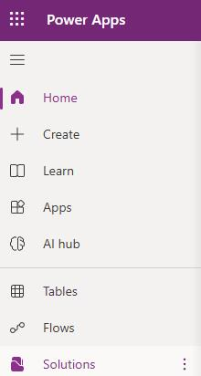
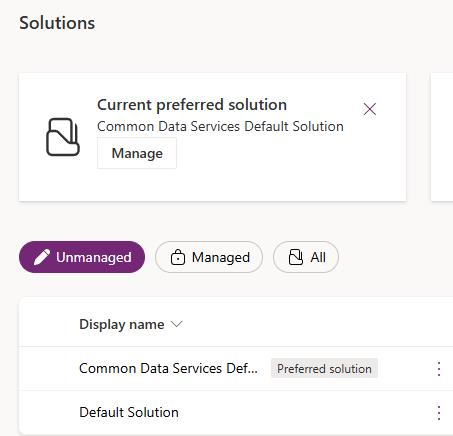
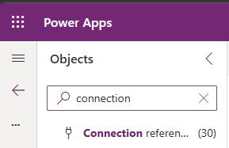
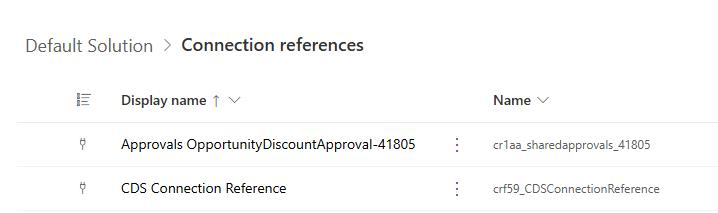
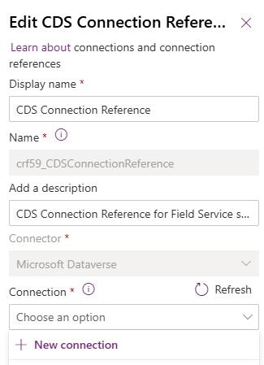
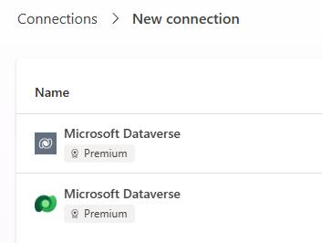
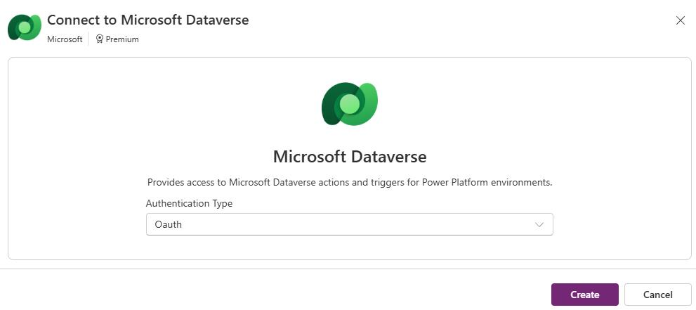
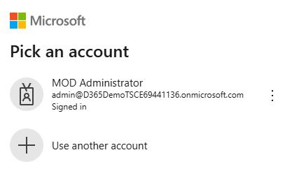
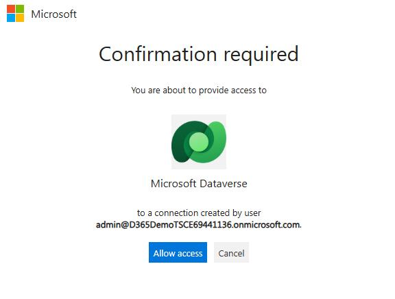
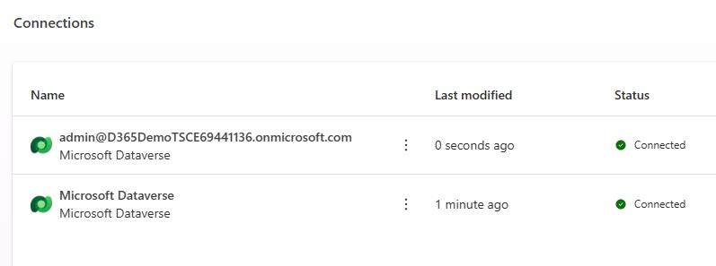

## Task 01: Set up connections and enable flows

### Introduction
Contoso's case automation relies on prebuilt connectors and Power Automate flows to invoke the agent, exchange data with Dataverse, and orchestrate actions behind the scenes. If those connections are missing or the flows are disabled, the agent cannot run end-to-end.

### Description
You'll update the required connection references in the Default Solution to use valid credentials in your environment, then you'll confirm the required Power Automate flows are enabled so agent-triggered processing can execute successfully.

### Success criteria
- All required connection references are set and the required Power Automate flows are turned on.

### Key steps

#### 01: Enable connection references

Now that we have configured your application user, we are going to ensure that the correct connection references are present.

1. In Edge, go to `https://make.powerapps.com`.

1. If prompted, sign in by using the administrative credentials for your demo environment.

1. At the top right of the page, select your demo environment.

	

1. In the left pane, select **Solutions**.

	

1.  In the list of solutions, select **Default Solution**.

	

1. In the **Objects** pane, search for and select `Connection References`.

	
	
1. On the **Connection References** page, search for and select `CDS Connection Reference`.

	

1. In the **Edit** pane, select **Connection** and then select **+ New connection**. 

	

1. In the list of connections, search for and select **Microsoft Dataverse**.
	
    {: .warning }
    > If **Microsoft Dataverse** is listed twice, perform Steps 10 through 12 for both.
	>
    > 

1. In the **Authentication Type** field, select **Oath** and then select **Create**.

	

1. In the **Pick an account** dialog, select your demo environment administrative credentials.

	

1. Select **Allow access**.

	

1. On the **Connections** page, verify the connection status.

	

1. Repeat Steps 4 through 13 to create the following connections:

	|Connection| Comments|
    | -------- | -------- |
    |**Microsoft Copilot Studio for Sales Close Agent - Research** | Use the **Microsoft Copilot Studio** connector instead of the **Microsoft Dataverse** connector. |

    
---

#### 02: Enable Power Automate flows

1. In Edge, go to `https://make.powerapps.com`.

1. If prompted, sign in by using the administrative credentials for your demo environment.

1. At the top right of the page, select your demo environment.

	

1. In the left pane, select **My Flows**.

1. Verify that the **Invoke case processing agent** and **Call custom agent** flows are enabled. flows are enabled.
