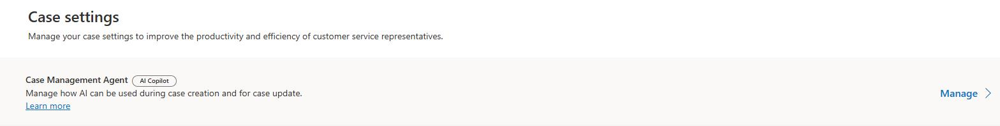
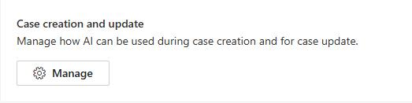
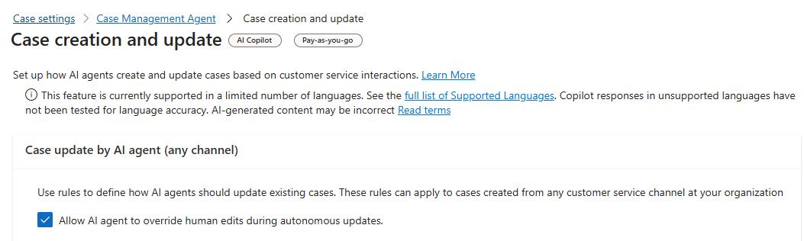
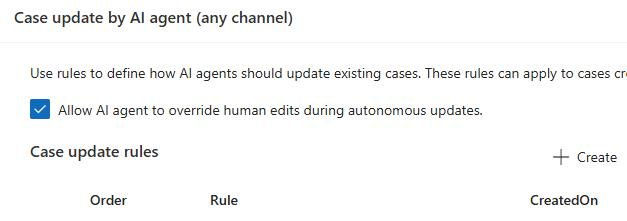
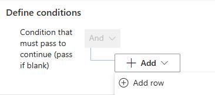
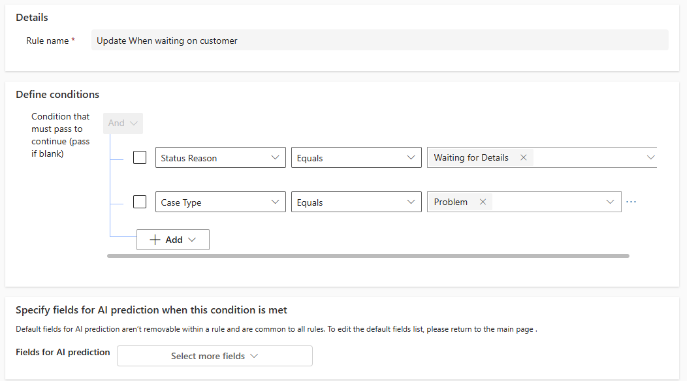
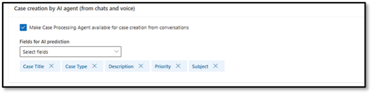
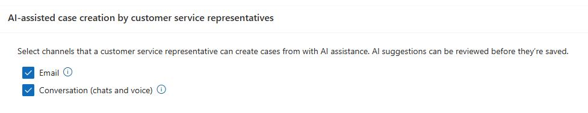
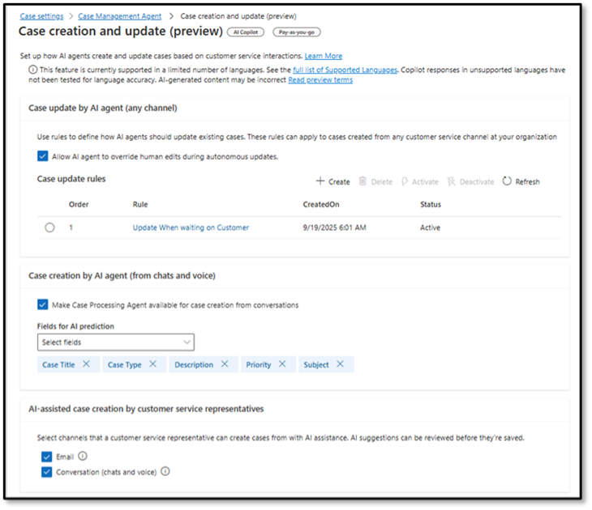

## Task 03: Configure case creation and update settings


### Introduction
With high volumes of installation, configuration, and maintenance cases, Contoso needs faster intake and cleaner case data. Enabling AI-assisted creation and targeted update rules helps reduce manual effort while keeping cases accurate across interactions.

### Description
You'll enable autonomous case updates, create an update rule for cases waiting on customer details, enable case creation from chats and voice, and turn on AI-assisted case creation for both email and conversations.

### Success criteria
- Case creation and update settings are enabled and the "Update When waiting on customer" rule is created and saved.

### Key steps

1. Open the **Copilot Service admin center** app.

	

1. In the left pane, in the **Customer support** section, select **Case Settings**.

	

1. Locate **Case Management Agent** and then select **Manage**.

    

1. In the **Case creation and update** section, select **Manage**.

	

1. In the **Case update by AI agent (Any channel)** section, select **Allow AI agent to override human edits during autonomous updates**.

	

1. In the **Case update rules** section, select **+ Create**.

	

1. In the **Rule name** field, enter:

    ```
    Update When waiting on customer
    ```

1. Select **+ Add** and then select **Add Row**.

	

1. Configure the row as follows:

	**Status Reason > Equals > Waiting for Details**

1. Select **+ Add** and then select **Add Row**.

1. Configure the row as follows:
	
    **Case Type > Equals > Problem**

1. The conditions should resemble the image below:

    

1. Select **Save**.

1. On the **Case creation and update** page, in the **Case creation by AI Agent (From chats and voice)**, select **Make Case Processing Agent available for case creation from conversations**.

    

1. In the **AI-Assisted case creation by customer service representatives**, select **Email** and **Conversation (Chats and voice)**.

    

1. Once configured, your **Case creation and update (preview)** screen should resemble the image below.

    