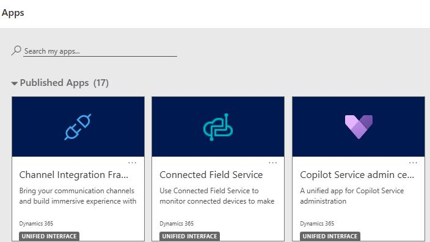
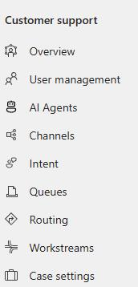
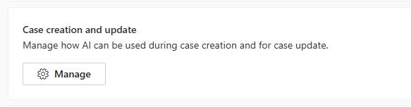
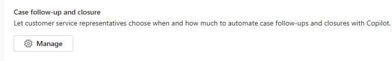
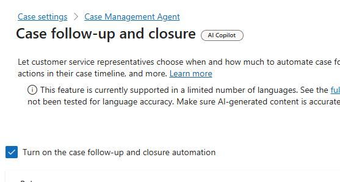
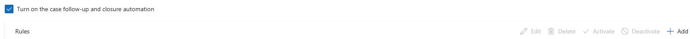
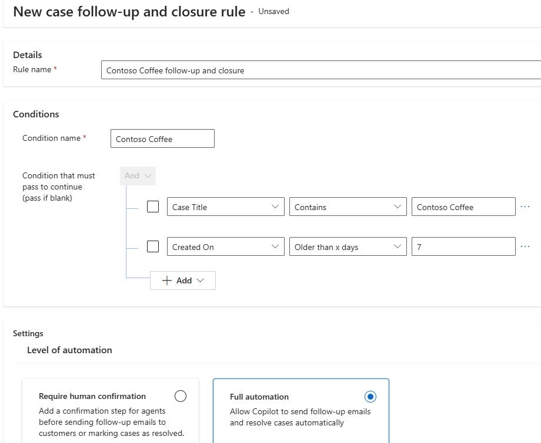
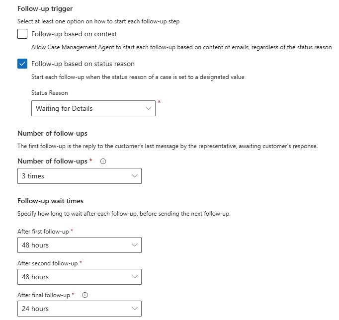
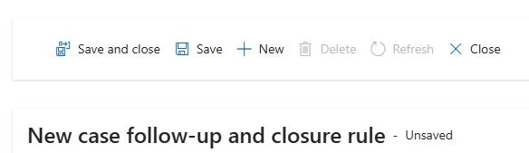
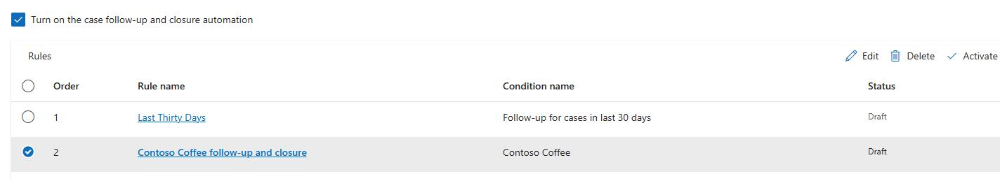

## Task 04: Configure autonomous case follow-up and closure

### Introduction
Contoso's global hubs can't afford unresolved cases to stall due to missing customer details. Automated follow-ups and closure reduce aging backlog, improve response consistency, and shorten overall resolution time.

### Description
You'll turn on follow-up and closure automation, create and configure a rule with full automation, define follow-up triggers and timing, then activate the rule so the agent can run the process end to end.

### Success criteria
- A follow-up and closure rule is activated, and full automation is enabled with the defined schedule.

### Key steps

1. Open the **Copilot Service admin center** app.

	

1. In the left pane, in the **Customer support** section, select **Case Settings**.

	

1. Locate **Case Management Agent** and then select **Manage**.

    

1. On the **Case Management Agent** page, in the **Case follow-up and closure** section, select **Manage**.

	

1. On the page that appears, select **Turn on the case follow-up and closure automation**.

    

1. On the command bar for the **Rules** section, select **+ Add**.

	

1. Configure the rule as follows:

    - **Rule name**: `Contoso Coffee follow-up and closure`
    - **Condition name**: `Contoso Coffee`

1. Configure the condition as follows:

    - **Case Title > Contains > Contoso Coffee**.
    - **Created on > Older than X days > 7**.

1. In the **Level of Automation** section, select **Full automation**.

    

1. Move down to the **Follow-up trigger** section. In the **Status Reason** field, select **Waiting for Details**.

1. Set **Number of follow-ups** to **3 times**.

1. Configure Follow-up wait times as follows:

    - **After first follow-up**: 48 hours

    - **After Second follow-up**: 48 hours

    - **After final follow-up**: 24 hours

    

1. On the command bar, select **Save and close**.

	

1. On the **Case follow-up and closure (preview)** page, select **Turn on the case follow-up and closure automation** and then select **Save**.

1. Select the **Contoso Coffee follow-up and closure** rule and then select **Activate**.

    