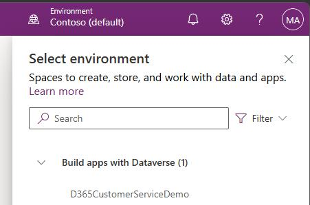
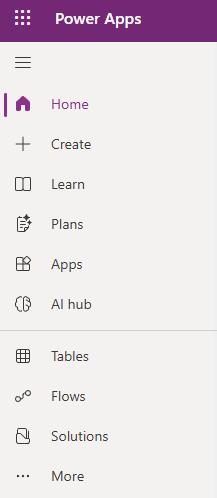
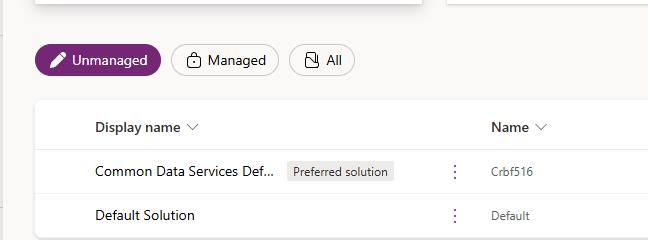
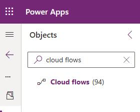
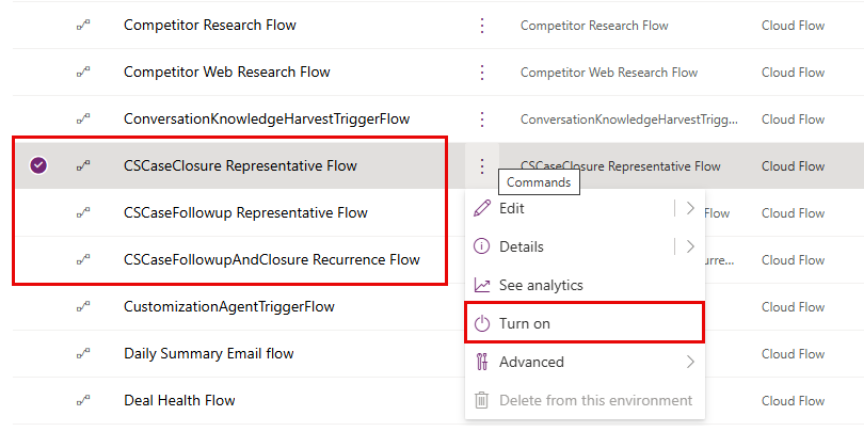

## Task 05: Enable Power Automate flows

### Introduction
The Case Management Agent depends on Power Automate to execute follow-up and closure actions reliably. If the flows are off or not connected, automation will fail even if the admin settings look correct.

### Description
You'll go to the Default solution, verify the required flows are connected to Dataverse and Copilot Studio (Preview), and turn on the case follow-up and closure flows needed for automation.

### Success criteria
- The required case follow-up and closure Power Automate flows are turned on and connected.

### Key steps
In Power Apps, make sure that the **CSCaseClosure Agent Flow, CSCaseFollowup Agent flow**, and **CSCaseClosure Representative Flow** are connected to Microsoft Dataverse and Microsoft Copilot Studio (Preview).

1. In Edge, go to `https://make.powerapps.com`.

1. If prompted, sign in by using the administrative credentials for your demo environment.

1. At the top right of the page, select your demo environment.

	

1. In the left pane, select **Solutions**.

	

1. Select **Default solution**.

	

1. In the **Objects** pane, search for and select `Cloud flows`.

	

1. For each of the following flows, select the ellipses (**...**)  and then select**Turn on**.

    - **CSCaseClosure Representative Flow**
    - **CSCaseFollowup Representative flow**
    - **CSCaseFollowupAndClosure Recurrence Flow**.

    